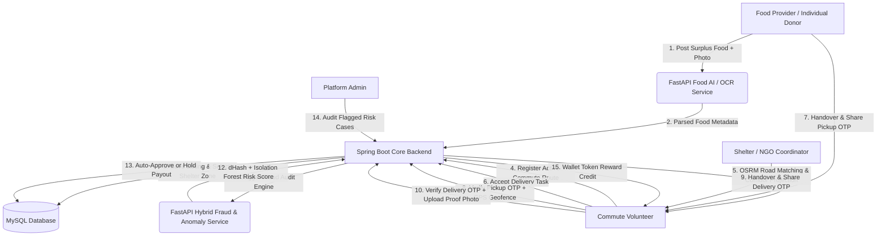
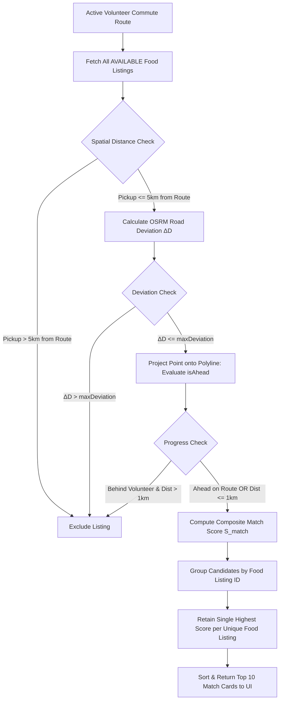
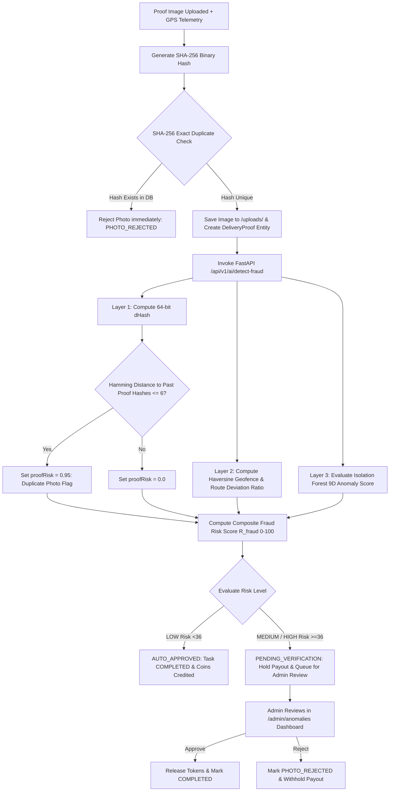
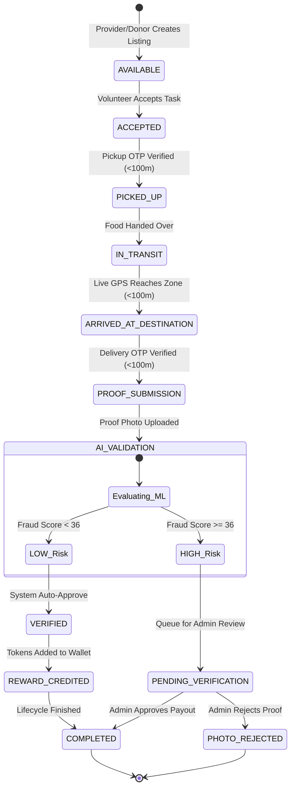

# Complete End-to-End System Scenario & Architecture Guide

## Document Overview
This document provides a comprehensive, real-world narrative and technical specification of the **AnnaSetu / FoodBridge** platform. It details how the entire system functions as a connected ecosystem—from the initial availability of surplus food at a commercial restaurant or private gathering, through shelter discovery, route-aware volunteer matching, two-stage OTP physical handovers, and multi-layered ML fraud auditing, up to final reward crediting and state completion.

---

# 1. System Ecosystem & Actor Roles

The platform operates as an event-driven, role-based ecosystem connecting five primary human actor groups with automated backend services, AI models, and geospatial mapping infrastructure.



### Actor Roles & Responsibilities Matrix

| Actor / System Component | Role & Purpose | Information Provided | Information Received | Stage of Involvement |
| :--- | :--- | :--- | :--- | :--- |
| **Food Provider / Restaurant** | Commercial entity (hotel, bakery, restaurant) donating surplus food. | Food name, portion count, category, expiry window, pickup address/GPS, food photo. | Pickup OTP, Volunteer arrival notification, completion alert. | Stage 1 (Listing Creation) & Stage 4 (Pickup Handover). |
| **Individual Donor** | Private individual with surplus from events (Weddings, Birthdays, Anniversaries). | Event occasion, dish list, quantity, address/GPS, availability window. | Pickup OTP, Volunteer pickup confirmation, delivery completion status. | Stage 1 (Listing Creation) & Stage 4 (Pickup Handover). |
| **Commute Volunteer** | Eco-conscious citizen who collects and delivers food along their regular commute. | Commute start/end locations, detour threshold ($maxDeviation$), live GPS telemetry, OTPs, proof photo. | Route match list, detour distance, matching compatibility score ($S_{\text{match}}$), reward coins. | Stage 2 (Route Creation), Stage 3 (Task Acceptance), Stage 4–6 (Transport & Delivery). |
| **Shelter / NGO Coordinator** | Authorized representative of registered shelter, orphan home, or community kitchen. | Shelter address/GPS, meal capacity, operating hours, NGO authorization proof document. | Food delivery arrival notification, Delivery OTP code. | Stage 1 (Shelter Registration) & Stage 5 (Dropoff Handover). |
| **Platform Administrator** | Security and system manager overseeing operations and risk alerts. | Verification decisions (Approve, Reject, Dismiss), shelter approvals. | Live transit metrics, pending shelter applications, flagged fraud risk assessments. | Continuous System Oversight & Stage 7 (Security Audit Review). |
| **FastAPI AI Service** | Microservice running OCR, demand prediction, and fraud detection models. | Multimodal OCR parsing, Random Forest demand scores, dHash fingerprints, Isolation Forest anomaly scores. | Raw food images, shelter capacity features, proof images, volunteer behavior vectors. | Stage 1 (Food Analysis) & Stage 6 (Fraud Audit). |
| **Spring Boot Backend** | Core orchestration engine handling state machine, spatial math, and DB transactions. | API responses, STOMP WebSocket broadcasts, JWT claims, OTP codes. | REST requests, multipart files, hardware GPS streams. | Active across all stages. |
| **MySQL Database** | Relational database persisting system state and transactional history. | Persistent entity rows (`food_listings`, `delivery_tasks`, `verifications`, `fraud_risk_assessments`). | JPA SQL queries and updates. | Active across all stages. |

---

# 2. Step-by-Step Real-World Journey

## Step 1 — Surplus Food Becomes Available

### Scenario Context
At 8:00 PM, **"Green Bowl Restaurant"** in Indiranagar, Bengaluru has 35 portions of surplus *Vegetarian Paneer Pulav & Dal* remaining after dinner service. The food is fresh, cooked at 6:30 PM, and safe for consumption until 11:30 PM (5-hour window).

### User Action & Information Entry
The restaurant manager opens the AnnaSetu Web App, navigates to `/provider/food/new`, and creates a surplus listing:
- **Food Photo Upload**: Manager takes a photo of the food containers.
- **Manual / AI Autofill**: Clicking "Analyze with Food AI" uploads the photo to FastAPI `POST /api/v1/ai/analyze-food`.
  - EasyOCR and image processing extract: `suggestedFoodName: "Paneer Pulav and Dal"`, `suggestedCategory: "VEG"`, `estimatedServings: 35`.
- **Form Fields Submitted**:
  - `foodName`: "Paneer Pulav & Dal"
  - `quantity`: `35`
  - `unit`: `MEALS`
  - `category`: `VEG`
  - `foodType`: `Vegetarian`
  - `description`: "Freshly prepared dinner surplus packed in disposable foil containers."
  - `allergens`: "Dairy (Paneer)"
  - `availableUntil`: `11:30 PM` (Converted to UTC timestamp)
  - `pickupLatitude`: `12.9784`
  - `pickupLongitude`: `77.6408`

---

## Step 2 — Backend System Processing & State Initialization

### API Call & Controller Action
The frontend issues an HTTP POST request:
`POST /api/v1/food-listings` with JSON payload + JWT Bearer token of the Food Provider.

### Backend Execution Flow (`FoodListingService.java`)
1. **User Role Validation**: Verifies authenticated user has `PROVIDER` or `INDIVIDUAL_DONOR` role.
2. **Entity Persistence**: A new `FoodListing` entity is created:
   - `id`: `9e947e7b-dc47-4ab3-872d-3c8321dd1f4d` (UUID)
   - `status`: `"AVAILABLE"`
   - `createdAt`: `2026-09-12 20:00:00`
   - `effectiveAvailableUntil`: `2026-09-12 23:30:00`
3. **Destination Shelter Auto-Assignment**: The backend checks for verified shelter zones in the database and assigns the optimal destination zone (`destinationZone`).
4. **WebSocket Broadcast**: Triggers `LiveTrackingWebSocketHandler` broadcasting `LISTING_CREATED` to active listeners.

---

# 3. How the Shelter Destination is Discovered & Chosen

## Shelter Registration & Information Hierarchy
Shelters and community distribution points are stored in the MySQL table `zones`. Shelters enter the system through two pathways:
1. **Coordinator Application**: An NGO coordinator submits shelter details at `/coordinator/dashboard`, uploading an authorization document (NGO license/ID proof). The status starts as `PENDING_VERIFICATION` until an Admin approves it in `/admin/dashboard`.
2. **Crowdsourced Community Need Discovery**: Volunteers report high-hunger areas via `/api/v1/zones/community-needs`. Admins inspect geotags and convert verified reports into active shelter zones.

### Information Stored per Shelter (`Zone.java`)
- `id` (UUID)
- `name` (e.g., "Central Community Shelter")
- `address`, `city`, `state`
- `latitude`, `longitude`
- `capacity` (e.g., `150` meals)
- `currentOccupancy` / `priorityScore` (1 to 10 scale)
- `verificationStatus` (`"VERIFIED"`, `"PENDING"`, `"EXPIRED"`)
- `status` (`"ACTIVE"`, `"INACTIVE"`)

---

## Shelter Selection Algorithm

```text
Available Food Listing (Pickup Lat/Lng, Meal Quantity)
                   │
                   ▼
       Query All Zones in Database
                   │
                   ▼
       Filter 1: Status Filter
       (verificationStatus == 'VERIFIED' AND status == 'ACTIVE')
                   │
                   ▼
       Filter 2: Expiry & Audit Check
       (validUntil not expired AND lastVerifiedAt within 30 days)
                   │
                   ▼
       Filter 3: Distance Bounding Filter
       (Haversine Distance(Food_Pickup, Zone_Location) <= 15.0 km)
                   │
                   ▼
       Filter 4: Capacity & Priority Ranking
       Score = (0.5 * PriorityScore) + (0.3 * CapacityScore) - (0.2 * DistancePenalty)
                   │
                   ▼
       Assign Destination Zone to Food Listing (destinationZone_id)
```

### Shelter Selection Implementation Reality
- **Primary Selector**: When a Food Listing is created or matched, the system assigns its explicit `destinationZone`. If the donor/provider selects a specific destination zone, that preference is preserved.
- **System Auto-Selector**: If no specific destination zone is selected, `FoodListingService` queries all active verified zones, calculates distance from pickup to zone using the Haversine formula, and selects the nearest high-priority verified shelter zone.

---

# 4. Where the Volunteer Enters the Workflow

## Volunteer Registration & Authentication
1. **Account Registration**: A user signs up at `/login` selecting the role `VOLUNTEER`.
2. **Profile Generation**: A row is created in `users` and linked 1-to-1 with a new `Volunteer` entity in `volunteers`:
   - `verificationStatus`: `"VERIFIED"`
   - `rating`: `5.0`
   - `totalDeliveries`: `0`
   - `successfulDeliveries`: `0`
   - `reliabilityScore`: `1.0`
   - `balanceTokens`: `0`
3. **Authentication**: Upon logging in, the volunteer receives a signed JWT token stored in browser `localStorage`.

---

## Volunteer Availability & Commute Journey Creation

Rather than forcing volunteers to make dedicated out-of-way trips, AnnaSetu matches surplus food directly to **existing volunteer commute journeys**.

### Commute Route Activation Flow
1. Volunteer opens `/volunteer/matching` ("Food Along Your Route").
2. Volunteer enters their commute corridor:
   - **Start Point**: e.g., "Sadashiva Nagar" (`13.006, 77.581`)
   - **End Point**: e.g., "Koramangala" (`12.935, 77.624`)
   - **Max Detour Threshold**: `maxDeviation = 3.0 km`
3. Clicking "Start Journey Route" issues `POST /api/v1/volunteers/routes`.
4. **Automatic Deactivation of Old Routes**: To prevent stale route clutter, `VolunteerService.addRoute` automatically sets all previous active routes for this volunteer to `status = "INACTIVE"` and sets the new route as `status = "ACTIVE"`.

---

# 5. How the Volunteer is Matched to Surplus Food

When the volunteer queries `/api/v1/volunteers/matching`, `VolunteerService.getMatchRecommendations` executes the matching pipeline.



### Exact Mathematical Matching Scoring Formula ($S_{\text{match}}$)
$$S_{\text{match}} = 0.25 S_{\text{route}} + 0.20 S_{\text{vol\_dist}} + 0.15 S_{\text{pos}} + 0.15 S_{\text{rel}} + 0.15 S_{\text{urgency}} + 0.10 S_{\text{dest\_comp}}$$

Where:
- **$S_{\text{route}}$ (Route Corridor Score)**: $0.6 \max(0, 100 - 15 \cdot \Delta D) + 0.4 \max(0, 100 - 50 \cdot d_{\text{corridor}})$
- **$S_{\text{vol\_dist}}$ (Proximity Score)**: $\max(0, 100 - 20 \cdot d_{\text{vol\_to\_pickup}})$
- **$S_{\text{pos}}$ (Ahead/Behind Progress Score)**: $100.0$ if $isAhead$ is true, else $10.0$ (heavy penalty for backward travel)
- **$S_{\text{rel}}$ (Volunteer Reliability)**: $\text{reliabilityScore} \times 100.0$
- **$S_{\text{urgency}}$ (Expiry Urgency)**: $100.0$ if time remaining $\le 30$ mins; $80.0$ if $\le 120$ mins; else $\max(20, 100 - t_{\text{rem}}/10)$
- **$S_{\text{dest\_comp}}$ (Destination Compatibility)**: $\max(0, 100 - 10 \cdot d_{\text{dropoff\_to\_route\_end}})$

### Deduplication Safeguard
To ensure no food listing appears twice on the volunteer's screen (even if multiple calculation passes occur), the backend groups candidates by `food.getId()` and retains only the single highest-scoring recommendation.

---

# 6. Route Deviation & OSRM Integration

When evaluating detour inconvenience, the system calculates the extra road distance required to make the pickup and dropoff compared to driving straight to the commute destination.

```text
Direct Commute:      Start -----------------------------------------> End
                     (Distance = D_direct)

Deviated Journey:    Start ---> Pickup ---> Dropoff Zone ---> End
                     (Distance = D_deviated)

Extra Deviation ΔD = D_deviated - D_direct
```

1. **OSRM API Query**: `MatchingService.java` constructs a driving route query:
   `https://router.project-osrm.org/route/v1/driving/startLng,startLat;pickupLng,pickupLat;dropLng,dropLat;endLng,endLat?overview=false`
2. **Road Distance Evaluation**: Returns real driving distance ($D_{\text{deviated}}$) in kilometers and estimated road time in minutes.
3. **Haversine Fallback**: If network offline or OSRM rate-limited, straight-line distance is computed with a $1.3\times$ urban circuitry multiplier.

---

# 7. Complete Volunteer Journey & Action Steps

| Step # | Screen / Page | User Action | API Endpoint Called | Backend / DB Action | Resulting Task Status |
| :--- | :--- | :--- | :--- | :--- | :--- |
| **1** | `/login` | Log in as Volunteer | `POST /api/v1/auth/login` | Validates credentials, returns JWT token. | User Authenticated |
| **2** | `/volunteer/matching` | Enter start/end address and click "Start Journey Route" | `POST /api/v1/volunteers/routes` | Saves `VolunteerRoute` row with `status = "ACTIVE"`. Deactivates older routes. | Journey Route Active |
| **3** | `/volunteer/matching` | View recommended food matches | `GET /api/v1/volunteers/matching` | Evaluates OSRM deviation, deduplicates by food ID, returns match cards. | Match Cards Rendered |
| **4** | `/volunteer/matching` | Click "Accept Delivery" on match card | `POST /api/v1/tasks/{id}/accept` | Checks atomic lock `assignVolunteerAtomic`. Links volunteer to task. Creates `Verification` entity with 6-digit Pickup OTP & Delivery OTP. | `ACCEPTED` (Food: `ACCEPTED`) |
| **5** | `/volunteer/dashboard` | View active delivery task & navigate to pickup | `GET /api/v1/tasks/my-active` | Fetches task details, pickup address, provider phone, and map route. | `ACCEPTED` |
| **6** | `/volunteer/dashboard` | Arrive at pickup point & enter 6-digit Pickup OTP | `POST /api/v1/verification/pickup` | Validates OTP match, checks attempts (<3), checks GPS geofence (<100m). Updates pickup timestamp. | `PICKED_UP` (Food: `IN_TRANSIT`) |
| **7** | `/volunteer/dashboard` | Drive toward shelter zone with live GPS streaming | `PUT /api/v1/volunteers/routes/{id}/location` (or WS) | Streams GPS coordinates to STOMP topic `VOLUNTEER_LOCATION_UPDATE`. Checks zone arrival (<100m). | `ARRIVED_AT_DESTINATION` |
| **8** | `/volunteer/dashboard` | Arrive at shelter & enter 6-digit Delivery OTP | `POST /api/v1/verification/delivery` | Validates OTP match, checks attempts (<3), checks dropoff geofence (<100m). Sets `deliveryRadiusVerified = true`. | `PROOF_SUBMISSION` |
| **9** | `/volunteer/dashboard` | Capture & upload delivery proof photo | `POST /api/v1/tasks/{id}/proof` | Saves image under `/uploads/`, evaluates SHA-256 hash, invokes FastAPI `POST /api/v1/ai/detect-fraud`. | `AI_VALIDATION` |
| **10** | System Processing | ML Fraud Audit Inference | FastAPI `/api/v1/ai/detect-fraud` | Computes dHash Hamming distance, Isolation Forest anomaly score, and hybrid Risk Score $R_{\text{fraud}}$. | `COMPLETED` (if LOW risk) OR `PENDING_VERIFICATION` (if MED/HIGH risk) |
| **11** | `/volunteer/rewards` | View updated coin wallet balance | `GET /api/v1/volunteers/wallet/transactions` | Credits dynamic reward coins ($10 + \text{Bonus}_{\text{qty}} + \text{Bonus}_{\text{dev}} + 3$), updates `balanceTokens`. | Payout Credited |

---

# 8. Two-Stage OTP Verification Mechanics

To ensure physical verification without relying solely on vulnerable software signals, AnnaSetu enforces a **Two-Stage Cryptographic OTP Handover Protocol**.

```text
[Task Acceptance] ──> Backend generates:
                      1. Pickup OTP (6-digit, e.g., "514125") -> Visible to Provider
                      2. Delivery OTP (6-digit, e.g., "855172") -> Visible to Shelter Coordinator

[Stage 1: Pickup Handover]
Volunteer arrives at Provider -> Provider views Pickup OTP on their Dashboard -> Tells Volunteer verbal OTP -> Volunteer inputs OTP + Current GPS into App -> Backend validates OTP match + Geofence < 100m -> Task Status: PICKED_UP

[Stage 2: Delivery Handover]
Volunteer arrives at Shelter -> Coordinator views Delivery OTP on their Dashboard -> Tells Volunteer verbal OTP -> Volunteer inputs OTP + Current GPS into App -> Backend validates OTP match + Geofence < 100m -> Task Status: PROOF_SUBMISSION
```

### Security & Anti-Gaming Rules Implemented
1. **Attempt Lockout**: `pickupOtpAttempts` and `deliveryOtpAttempts` track invalid entries. If attempts reach 3, verification locks automatically.
2. **Expiry Window**: Pickup and Delivery OTPs expire automatically after 60 minutes.
3. **Geofence Check**: Distance from submitted GPS coordinates to target pickup/dropoff point must be $\le 100\text{ meters}$.
4. **OTP Reuse Prevention**: Once verified, timestamps are saved (`pickupTimestamp`, `deliveryTimestamp`). Re-submitting an already used OTP returns an error.

---

# 9. Delivery Proof & Multi-Layer Fraud Audit

When the volunteer uploads a dropoff proof photo, `DeliveryTaskService.processDeliveryProof` initiates a multi-layered security audit.



### Fraud Detection Layer Details

1. **SHA-256 Binary Check**: Immediately catches byte-for-byte identical photo re-uploads.
2. **dHash Perceptual Hashing (64-bit)**: Converts proof photo to an $8 \times 8$ grayscale gradient bit-matrix. Compares Hamming distance against all past proof photos in `fraud_risk_assessments`. Catching recycled photos even if resized, re-compressed, or converted between JPEG/PNG.
3. **Isolation Forest Behavioral Anomaly Model**: Unsupervised ML model trained on 9 behavioral features:
   $$\mathbf{v} = [\text{cancellationRate}, \text{gpsMismatchRate}, \text{routeDeviationRatio}, \text{timeDurationRatio}, \text{otpFailures}, \text{proofFailures}, \text{dupCount}, \text{pastSuspicious}, \text{completedCount}]$$
4. **Spatial & Temporal Telemetry Audit**: Verifies capture location against target shelter coordinates and flags travel duration anomalies (e.g., submitting dropoff proof 30 seconds after pickup for a 5 km journey).

---

# 10. Demand Prediction & Shelter Prioritization

## Demand Prediction Engine (`ai-service/app/services/demand_predictor.py`)
- **Model**: Scikit-Learn `RandomForestRegressor` trained on historical shelter demand patterns.
- **Input Features**:
  - `DayOfWeek` (0 = Monday, 6 = Sunday)
  - `TimeSlotHour` (0 to 23)
  - `OperatingHours` (shelter open duration)
  - `ZonePreviousCapacity` (maximum meal capacity)
- **Output**: `predictedMeals` (expected meal shortage count) and `confidence` score.

### Role in Workflow
- **Admin & Coordinator Intelligence**: Coordinators and Admins view forecasted hunger demand at `/admin/zones` ("Forecast Demand"), enabling proactive supply dispatch to high-risk zones.
- **Shelter Priority Weighting**: High predicted demand increases a zone's `priorityScore`, causing `FoodListingService` to prioritize that shelter during destination auto-assignment.

---

# 11. AI/ML Components Summary Matrix

| AI / ML Component | Implementation Location | Input Data | Output Generated | Workflow Impact | Real ML vs Rule Logic |
| :--- | :--- | :--- | :--- | :--- | :--- |
| **Multi-Item Food OCR & Parser** | `ai-service/app/main.py` (`/analyze-food`) | Raw Food Image | Food items, category, quantity, allergens | Autofills food creation form for providers | **Real ML** (EasyOCR + Image Processing) |
| **Random Forest Demand Predictor** | `ai-service/app/services/demand_predictor.py` | Day, Hour, Operating Hours, Capacity | Predicted Meal Demand & Priority | Prioritizes shelter zones & admin forecasts | **Real ML** (`RandomForestRegressor`) |
| **Isolation Forest Anomaly Detector** | `ai-service/app/services/fraud_detector.py` | 9-dimensional Volunteer Behavior Vector | Anomaly Decision Score $s \in [-1, 1]$ | Inputs into Fraud Risk Score calculation | **Real ML** (`IsolationForest`) |
| **Perceptual Image Fingerprinting** | `ai-service/app/services/fraud_detector.py` | Proof Image | 64-bit dHash & Hamming Distance | Flags copy-pasted or recycled proof photos | **Algorithmic CV** (`imagehash.dhash`) |
| **OSRM Route Deviation Engine** | `MatchingService.java` | Waypoint Coordinates array | Driving Distance ($\text{km}$) & Duration ($\text{mins}$) | Penalizes out-of-way volunteer travel | **Algorithmic** (Graph Shortest Path) |

---

# 12. Database Entity Lifecycle & State Machine



### Detailed Entity State Definitions

| Entity | State | Trigger / Caused By | Next Allowed Transition |
| :--- | :--- | :--- | :--- |
| **FoodListing** | `AVAILABLE` | Created by Provider or Individual Donor | `ACCEPTED`, `EXPIRED` |
| **FoodListing** | `ACCEPTED` | Volunteer accepts delivery task | `IN_TRANSIT` |
| **FoodListing** | `IN_TRANSIT` | Pickup OTP verified at provider location | `DELIVERED` |
| **FoodListing** | `DELIVERED` | Dropoff proof verified & task completed | End of lifecycle |
| **FoodListing** | `EXPIRED` | System cron detects `effectiveAvailableUntil` passed | End of lifecycle |
| **DeliveryTask** | `CREATED` | Task initialized upon listing creation | `ACCEPTED` |
| **DeliveryTask** | `ACCEPTED` | Volunteer accepts match recommendation | `PICKED_UP` |
| **DeliveryTask** | `PICKED_UP` | Valid Pickup OTP submitted within 100m geofence | `ARRIVED_AT_DESTINATION` |
| **DeliveryTask** | `ARRIVED_AT_DESTINATION` | Live GPS streaming enters dropoff geofence | `PROOF_SUBMISSION` |
| **DeliveryTask** | `PROOF_SUBMISSION` | Valid Delivery OTP submitted within 100m geofence | `AI_VALIDATION` |
| **DeliveryTask** | `AI_VALIDATION` | Proof photo uploaded; ML fraud audit running | `COMPLETED`, `PENDING_VERIFICATION`, `PHOTO_REJECTED` |
| **DeliveryTask** | `PENDING_VERIFICATION` | ML Fraud Risk Score $\ge 36$ (Medium/High Risk) | `COMPLETED` (Admin Approve) or `PHOTO_REJECTED` (Admin Reject) |
| **DeliveryTask** | `COMPLETED` | Fraud audit passed (or Admin approved); tokens credited | End of lifecycle |

---

# 13. One Food Donation — Complete End-to-End Narrative

### Concrete Scenario: "Ananya's 50 Surplus Birthday Meals"

1. **8:00 PM — Surplus Generation**: Ananya finishes her birthday celebration at Sadashiva Nagar, Bengaluru. 50 portions of Paneer Butter Masala, Veg Pulav, and Gulab Jamun remain untouched.
2. **8:05 PM — Listing Creation**: Ananya opens the AnnaSetu Web App, uploads a photo of the food trays, and clicks "Analyze". The FastAPI AI service parses the photo and returns `50 meals, Category: VEG`. Ananya confirms the expiry as 11:30 PM and clicks "Post Donation".
   - *Database State*: `food_listings` row created (`status = "AVAILABLE"`). Assigned destination: *Central Shelter Zone*.
3. **8:10 PM — Volunteer Route Activation**: Rahul, a volunteer commuting from Yelahanka to Koramangala, opens `/volunteer/matching` and starts an active commute route (`maxDeviation = 3.0 km`).
   - *Database State*: `volunteers_routes` row created (`status = "ACTIVE"`).
4. **8:11 PM — Route Matching Calculation**: Rahul's app queries `/api/v1/volunteers/matching`. `MatchingService.java` calculates:
   - Extra detour distance: $\Delta D = 1.8\text{ km}$ (under 3.0 km limit).
   - Position check: Ananya's location is ahead on Rahul's commute corridor ($isAhead = \text{true}$).
   - Expiry urgency: 3.5 hours remaining.
   - Composite Score: $S_{\text{match}} = 84.5\%$ ("Good Match").
   - Result: Rahul sees 1 clear card: *"Birthday Surplus — 50 Meals (Personal Donation)"*.
5. **8:12 PM — Task Acceptance**: Rahul clicks "Accept Delivery".
   - *Database State*: `delivery_tasks` updated to `ACCEPTED`. `verifications` row created with Pickup OTP `482910` and Delivery OTP `739104`. Ananya receives a notification.
6. **8:25 PM — Pickup Verification**: Rahul arrives at Ananya's location. Ananya views Pickup OTP `482910` on her phone and tells Rahul. Rahul enters `482910` into his app. The backend verifies the OTP and checks Rahul's GPS coordinates (distance = 24 meters $\le 100\text{m}$).
   - *Database State*: `verifications.pickupTimestamp` saved. Task status updated to `PICKED_UP`. Food status updated to `IN_TRANSIT`.
7. **8:45 PM — Transport & Delivery**: Rahul drives to Central Shelter Zone. Live hardware GPS updates stream via WebSocket. Upon arrival, Shelter Coordinator Ramesh meets Rahul, inspects the food containers, and provides Delivery OTP `739104`. Rahul submits `739104`. Backend checks dropoff geofence (distance = 18 meters $\le 100\text{m}$).
   - *Database State*: Task status updated to `PROOF_SUBMISSION`.
8. **8:47 PM — Photo Proof & Fraud Audit**: Rahul takes a photo of Coordinator Ramesh receiving the food containers and uploads it.
   - `DeliveryTaskService` calculates dHash fingerprint `0000807060800000`. Hamming distance to historical hashes is 28 ($> 6$, no duplicate).
   - Isolation Forest evaluates Rahul's behavior vector: `cancellationRate = 0.0`, `gpsMismatchRate = 0.0`, `otpFailures = 0`. Anomaly score is normal.
   - Hybrid Fraud Risk Score: $R_{\text{fraud}} = 12.4$ (`LOW RISK`).
   - *Database State*: `fraud_risk_assessments` row saved (`reviewStatus = "AUTO_APPROVED"`). Task status updated to `COMPLETED`. Food status updated to `DELIVERED`.
9. **8:48 PM — Payout Credited**: The backend computes dynamic reward coins ($10 \text{ base} + 5 \text{ qty bonus} + 2 \text{ dev bonus} + 3 = 20 \text{ coins}$). Rahul's wallet balance increases by 20 tokens. Ananya receives a notification: *"Your 50 surplus meals were successfully delivered to Central Shelter Zone!"*

---

# 14. Automatic System Actions vs Manual Actions Matrix

| Action | User Action | System Automatic | AI / ML Algorithm | Admin Intervention |
| :--- | :--- | :--- | :--- | :--- |
| **Food Form Population** | Upload Photo | — | EasyOCR / Vision Parser | — |
| **Shelter Auto-Assignment** | Select (Optional) | Haversine Nearest Search | — | Override (Optional) |
| **Route Detour Calculation** | Input Route | Query OSRM Road API | Vector Segment Projection | — |
| **Candidate Match Scoring** | View List | Compute $S_{\text{match}}$ Vector | Expiry & Proximity Decay | — |
| **Candidate Deduplication** | — | Group by Food ID & Filter | Keep Max $S_{\text{match}}$ | — |
| **Pickup / Dropoff Verification** | Input 6-digit OTP | Check GPS Geofence (<100m) | — | — |
| **Duplicate Photo Audit** | Upload Photo | Calculate SHA-256 Hash | 64-bit dHash Hamming Distance | — |
| **Behavioral Anomaly Audit** | — | Extract Telemetry Vector | Isolation Forest Inference | — |
| **Fraud Escalation & Hold** | — | Hold Payout if $R_{\text{fraud}} \ge 36$ | Risk Level Classification | — |
| **Fraud Manual Resolution** | — | — | — | Approve / Reject / Dismiss |
| **Reward Token Crediting** | — | Increment Wallet Balance | Compute Dynamic Coin Formula | — |

---

# 15. External Services & Infrastructure Dependencies

| Service / Dependency | Integration Type | Input Provided | Output Received | Primary Purpose |
| :--- | :--- | :--- | :--- | :--- |
| **OSRM Driving API** (`router.project-osrm.org`) | External REST HTTP | Waypoint Coordinates array | OSRM Driving Distance (km) & Duration (mins) | Real road network routing and detour calculation. |
| **OpenStreetMap Nominatim** | External REST HTTP | Address text / Geotag coordinates | Geocoded Lat/Lng / Reverse Address string | Location search autocomplete and reverse geocoding. |
| **Leaflet Maps** | Frontend JS Library | Markers array & Polyline points | Interactive Map Canvas | Visualizing volunteer position, route corridor, and pickup/dropoff pins. |
| **Scikit-Learn** | Python ML Library | Feature Matrices ($\mathbf{X}$) | Joblib Model Files (`RandomForest`, `IsolationForest`) | Machine learning model training and inference. |
| **EasyOCR** | Python CV Library | Raw Image Bytes | Extracted Text Bounding Boxes & Strings | Multi-item food packaging and label OCR parsing. |
| **ImageHash / PyWavelets** | Python Library | PIL Image | 64-bit dHash Hex String | Perceptual image fingerprinting for fraud detection. |

---

# 16. Platform Explained in 5 Minutes

### 1. What problem does AnnaSetu solve?
AnnaSetu solves urban food waste and hunger by connecting time-critical surplus food (from restaurants, hotels, weddings, and parties) with nearby shelters and community distribution points using existing volunteer commute journeys.

### 2. Who uses the platform?
Four main user groups:
- **Food Providers & Individual Donors**: Post surplus food listings.
- **Commute Volunteers**: Transport food along their regular travel routes.
- **Shelter / NGO Coordinators**: Receive food and manage distribution.
- **Platform Admins**: Monitor live operations and resolve security/fraud flags.

### 3. How does food enter the system?
A donor or restaurant manager snaps a photo of the surplus food containers and uploads it via `/provider/food/new` or `/donor/dashboard`. An integrated OCR vision service automatically extracts dish names, quantities, and categories. The donor sets the expiry time, and the listing becomes `AVAILABLE`.

### 4. How does the system find the right shelter?
The backend queries verified shelter zones stored in the database. It filters active shelters within a 15 km radius, evaluates shelter meal capacities and priority scores, and assigns the optimal destination shelter to the food listing.

### 5. Where does the volunteer come in?
Instead of creating dedicated out-of-way trips, volunteers register their standard daily commute route (e.g., traveling from home to work). The system monitors active commute corridors and presents food listings that require minimal detour distance.

### 6. How is the volunteer selected?
The system calculates a composite **Matching Score ($S_{\text{match}}$)** evaluating OSRM road distance, detour deviation ($\Delta D$), ahead/behind route progress ($isAhead$), volunteer reliability rating, and food shelf-life urgency. The single best candidate per food listing is presented to the volunteer, who reviews the detour details and accepts the task.

### 7. How does the volunteer collect the food?
The volunteer drives to the provider's location. The provider views a unique 6-digit **Pickup OTP** on their dashboard and shares it verbally. The volunteer enters the OTP into their app. The backend verifies the OTP code and confirms the volunteer's GPS coordinates are within 100 meters of the pickup point before updating the status to `PICKED_UP`.

### 8. How does the food reach the shelter?
The volunteer drives toward the destination shelter. Live hardware GPS updates stream via WebSocket to the platform. Upon arrival, the shelter coordinator shares a unique 6-digit **Delivery OTP**. The volunteer submits the OTP, and the backend verifies the dropoff geofence.

### 9. How does the system verify delivery and handle fraud?
The volunteer uploads a photo showing the delivered food at the shelter. The backend passes the image and delivery telemetry to the FastAPI AI service:
- **Perceptual Hashing (dHash)**: Computes a 64-bit fingerprint of the photo and checks Hamming distance against past submissions to catch copy-pasted or recycled proof images.
- **Isolation Forest Anomaly Detection**: Evaluates a 9-dimensional vector of volunteer behavioral telemetry (cancellation rates, GPS mismatch rates, duration ratios).
- **Hybrid Risk Score**: If the fraud score is Low ($<36$), the delivery is automatically marked `COMPLETED` and reward tokens are credited. If Medium/High ($\ge 36$), payout is held and queued for Admin review.

### 10. What happens after successful delivery?
The food status changes to `DELIVERED`, the volunteer earns dynamic reward coins added to their token wallet, and both donor and shelter receive completion confirmations.

---

# 17. Connecting This Scenario to Your Research Paper

When converting this working system into your academic research paper, map the system components directly to standard research paper sections:

| Research Paper Section | Corresponding System Component in `COMPLETE_SYSTEM_SCENARIO.md` |
| :--- | :--- |
| **System Architecture** | Section 1 (Ecosystem Diagram, Microservices, Spring Boot + FastAPI) |
| **Spatiotemporal Matching Formulation** | Section 5 & 6 (OSRM Road Routing, Detour $\Delta D$, Composite Score $S_{\text{match}}$) |
| **Security & Handover Protocol** | Section 8 (Two-Stage Cryptographic Geofenced OTP Handover Protocol) |
| **Hybrid Fraud Detection Methodology** | Section 9 (64-bit dHash Perceptual Hashing + Isolation Forest Anomaly Inference) |
| **Predictive Demand Allocation** | Section 10 (Random Forest Zone Hunger Demand Regressor) |
| **Experimental Results & Verification** | Section 13 (`verify_personal_donation.py`, `verify_flow.py`, `verify_fraud_detection.py`) |
