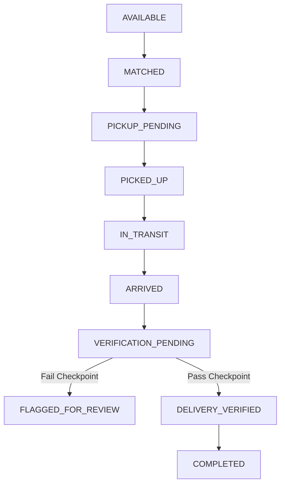

# E-Meal Route-Based Food Waste Management & Redistribution System

A high-fidelity route-aware logistics platform designed to optimize food redistribution, prevent waste, and ensure tracking compliance through secure OTP handshakes and geospatial proximity boundaries.

---

## 1. Project Directory Structure

```text
food-redistribution-system/
│
├── frontend/                 # React, Vite, TS, Tailwind CSS interface
│   ├── src/
│   │   ├── components/       # MapView and other utility components
│   │   ├── pages/            # Dashboards, CreateFoodListing, VolunteerRewards, etc.
│   │   └── context/          # Auth context for JWT security states
│   └── package.json
│
├── backend/                  # Java, Spring Boot, JPA, Security backend
│   ├── src/main/java/        # Entities, repos, controllers, matching filters
│   └── pom.xml
│
└── ai-service/               # Python, FastAPI, Pandas, scikit-learn service
    ├── app/main.py           # Isolation Forest anomalies & Random Forest demand
    └── requirements.txt
```

---

## 2. Quick Start Running Guide

### Step A: Python AI Inference Server
Initialize the FastAPI server to process ML operations.
```bash
cd ai-service
pip install -r requirements.txt
python app/main.py
```
*App is active at: `http://localhost:8000`*

### Step B: Core Spring Boot Engine
Set up core business logic & data seeders. The default database engine is H2 in-memory.
```bash
cd backend
mvn spring-boot:run
```
*API is active at: `http://localhost:8080`*

### Step C: React Client Console
Launch the frontend client application. Vite proxies `/api/v1` traffic to `http://localhost:8080/api/v1`.
```bash
cd frontend
npm install
npm run dev
```
*Client Console is active at: `http://localhost:5173`*

---

## 3. Demonstration Credentials

Open `http://localhost:5173` and sign in with the following preset credentials:

*   **Food Provider:** `provider1@food.com` | Password: `password`
*   **Volunteer Commuter:** `rahul@food.com` | Password: `password`
*   **Platform Admin:** `admin@food.com` | Password: `password`

---

## 4. System Workflows & State Machines

### Core State Transition Cycles
All state transitions are strictly backend-controlled to maintain validation compliance:



### Real-time Telemetry & Live Tracking
* When a task changes to `IN_TRANSIT`, the volunteer browser invokes a background telemetry scheduler that dispatches current coordinates to the backend every 8 seconds via `POST /api/v1/tasks/{id}/location`.
* The server logs each node in `location_trackings` and updates `currentLatitude` / `currentLongitude` on the task.
* The provider details page (`/provider/food/{id}`) polls the backend to move the volunteer map marker dynamically in real-time.

### Multi-Verification Security Gate (Pass / Fail Checklist)
To claim coins, the volunteer must satisfy:
1. **Distance Proximity:** Hand-off coordinate must reside within 250m of the target shelter zone (backend calculated).
2. **Secure OTP Handshake:** Verify both Pickup (provider-provided) and Drop-off (coordinator-provided) 6-digit tokens.
3. **MIME/Image Validation:** Proof image undergoes format and size constraints.
4. **Duplicate Safeguard:** Proof image URL/Hash and coordinates cannot match older transaction nodes.
5. **AI Evaluation:** Telemetry speed and anomalies are verified by the FastAPI service.

If any check fails, the task degrades to `VERIFICATION_PENDING` for Admin review, rating penalties are applied, and token payouts are withheld.

---

## 5. Wallet & Restaurant Rewards System

### Points Payout Algorithm
Successful verifications trigger a dynamic reward calculation:
* **Base points:** `10`
* **Portion magnitude bonus:** `+1` to `+5` points based on quantity meals.
* **Urgency bonus:** up to `+5` points for fast transit of short-lived foods.
* **Deviation bonus:** up to `+3` points for commute compliance.
* **Confidence bonus:** `+3` points for highly verified drops.

### Discount Redemption Portal
* Volunteers can navigate to `/volunteer/rewards` to view points, claim vouchers at partner restaurants (e.g., *Green Bowl Kitchen*, *Urban Harvest Cafe*).
* Vouchers generate a secure, unique discount coupon code (deleting points from volunteer profile balance and appending a transaction record of type `REDEMPTION`).

---

## 6. Central REST API Definitions

| Method | Endpoint | Description |
|---|---|---|
| **POST** | `/api/v1/food` | Publishes a new surplus donation. |
| **POST** | `/api/v1/tasks/{id}/accept` | Activates route-matching acceptance. |
| **POST** | `/api/v1/verification/pickup` | Verifies pickup OTP & latitude/longitude coordinates. |
| **POST** | `/api/v1/tasks/{id}/location` | Submits periodically updated tracker GPS telemetry. |
| **POST** | `/api/v1/verification/delivery` | Finalizes drop-off radius check, OTP, and proof image evaluation. |
| **GET** | `/api/v1/rewards` | Returns the eligible partner discounts list catalog. |
| **POST** | `/api/v1/rewards/{id}/redeem` | Deducts tokens and returns generated unique voucher coupon. |
| **GET** | `/api/v1/rewards/redemptions` | Retrieves history of coupon codes. |
